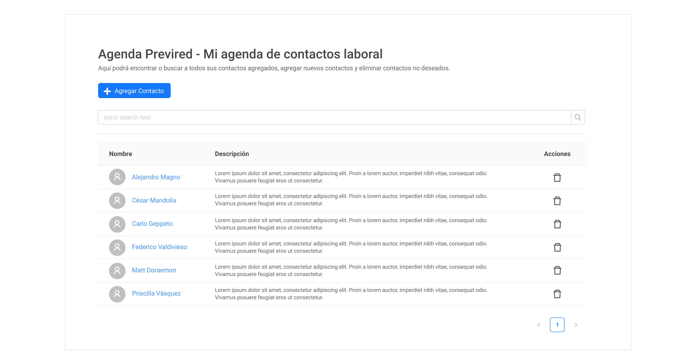
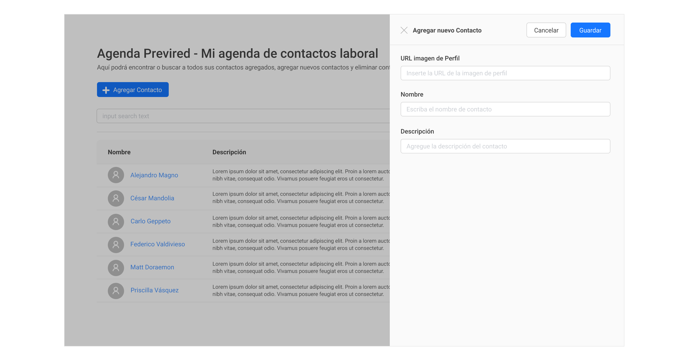

## Previred Frontend Test - Agenda de contactos

### Introducción

La siguiente prueba busca evaluar los conocimientos que hayas desarrollado en javascript/typescript, css y html, y su aplicación en un proyecto React.

### Descripción e instalación

Se adjunta un proyecto de nodejs, con una pequeña base de datos y una api ya desarrollada. Para ejecutar el proyecto, una vez descargado hay que correr las siguientes líneas por línea de comandos en el root del proyecto:

```
npm install
node server.js
```

Los requisitos son únicamente tener instalado una versión de `node >= 4` y `npm`.
Si todo funcionó correctamente, va a correr el servidor, y vas a poder acceder a través de cualquier navegador en la dirección: [localhost:9000](http://localhost:9000).

### Desarrollo

El objectivo del test es crear una aplicación React desde cero y desarrollar 2 vistas utilizando la api incluida en el proyecto.

La primera vista consiste en una lista paginada de usuarios con un buscador. Se debe visualizar la imagen del usuario con su respectivo nombre, y la descripción al lado, como se ve a continuación:



La segunda vista consiste en el formulario para agregar un usuario. Se gatilla un drawer al presionar el botón de `Agregar Contacto` de la vista anterior. La única validación que debe hacer este formulario, es que verifique que se incluyen todos los campos. Una vez completado, al presionar el botón `Guardar` debe enviar la información por AJAX a la api para crear el usuario. La vista se muestra a continuación:



### Descripción de la API

El proyecto incluye la api y la base de datos de almacenamiento. La api es REST, y a continuación se especifican sus métodos:

| Método HTTP | Ruta           | Descripción                                                                                                                                                                                                            |
| ----------- | :------------- | ---------------------------------------------------------------------------------------------------------------------------------------------------------------------------------------------------------------------- |
| GET         | /api/users     | Devuelve la lista de todos los usuarios. Para paginar necesita recibir adicionalmente los parámetros `_page` y `_limit` : `/api/users?_page=2&_limit=10`. Para buscar, necesita el parámetro `q`: `/api/users?q=texto` |
| GET         | /api/users/:id | Devuelve únicamente el usuario especificado por el id                                                                                                                                                                  |
| POST        | /api/users     | Crea un usuario nuevo. Debe incluir el header `Content-Type: application/json`, y los parámetros en formato JSON. Ej: `{"name": "Algún nombre","description": "Alguna descripción","photo": "Alguna URL"}`             |
| DELETE      | /api/users/:id | Elimina el usuario correspondiente al id dado.                                                                                                                                                                         |

### Criterios de evaluación

Se pide específicamente el uso de [React](https://facebook.github.io/react/). versión 17+. Dará un valor adicional, aunque no es obligatorio, el uso además de API-Context para la administración de estados en la aplicación. Adicionalmente se evaluarán los siguientes puntos:

1. Utilización de patrones, buenas prácticas en el código y arquitectura acorde
2. Documentación en el código
3. Diseño lo más similar posible a las imágenes mostradas más arriba
4. Tiempo en realizar la tarea
5. Uso de custom Hooks
6. Uso de Ant Design como librería de estilos

### Plazos y envío

Esta prueba considera un plazo máximo que podrás encontrar en el correo de contacto, y es además un criterio de evaluación, por lo que se espera una buen balance entre calidad y el tiempo usado. Una vez terminada la tarea, debes enviar un pull request al repositorio con tu nombre completo, correo y cargo al que postulas, además de notificar por correo que has finalizado la prueba. Cabe destacar, que todos los PRs serán rechazados una vez que se revisen, lo que no significa que tu proceso haya sido descartado, es sólo parte del procedimiento una vez que tu solución es revisada.


# Datos
- Nombre: Stefano Quiroz
- Correo: stefano.quiroz93@gmail.com
- Cargo: Desarrollador Front-end React Ssr

# Desafío React Agenda

Descripción general del proyecto Desafío React Agenda.

## Estructura del Proyecto

El proyecto está organizado de la siguiente manera:

- `src/`: Directorio principal para el código fuente.
  - `components/`: Componentes reutilizables de React.
    - `AddUserDrawer.tsx`
    - `CommonLayout.tsx`
    - `ContactTable.tsx`
    - `SearchBar.tsx`
    - `UserList.tsx`
  - `contexts/`: Contextos de React para el manejo de estado global.
    - `UserContext.tsx`
  - `hooks/`: Hooks personalizados de React.
    - `useUser.ts`
  - `interfaces/`: Tipos y interfaces de TypeScript.
    - `interface.ts`
  - `pages/`: Componentes de página de React.
    - `AddUserPage.tsx`
    - `HomePage.tsx`
  - `services/`: Servicios para la lógica de negocio y comunicación con APIs.
    - `userService.ts`
  - `utils/`: Utilidades y herramientas.
    - `api.ts`
  - `App.tsx`: Componente principal de la aplicación React.
  - `main.tsx`: Punto de entrada principal de la aplicación.

## Backend

El backend de este proyecto está desarrollado en [tecnología/lenguaje que se usó para el backend].

### Ejecución del Backend

Para ejecutar el backend, sigue estos pasos:

1. Navega al directorio del backend: `cd desafio-react-agenda`
2. Instala las dependencias: `npm install`
3. Inicia el servidor: `node server.js`

## Frontend (React)

El frontend está construido con React [versión de React].

### Ejecución del Frontend

Para ejecutar el frontend, sigue estos pasos:

1. Navega al directorio del frontend: `cd desafio-react-agenda/mi-agenda-contactos`
2. Instala las dependencias: `npm install`
3. Inicia la aplicación React: `npm run dev`